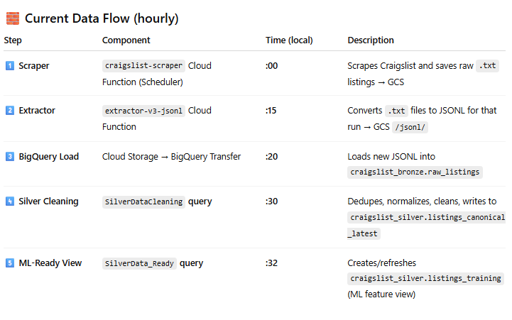

# Welcome to our basic scraping and ETL lecture!

At the end of this module, you will be able to
1) Scrape data off of craigsList as txt. files (GCP, GitHub Actions, BeautifulSoup) - DONE
2) Convert data from raw txt to structured JSON files (price, make, model, mileage) - DONE
3) Ingest data into BigQuery and make three types of data (bronze, silver, gold)
4) Build a basic sklearn decision tree regressor
5) If time, using VertexAI ML functions

